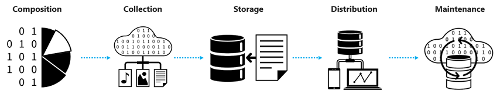

# Topic 2: Data ingestion: Avoiding Risks Associated with Data Acquisition

Welcome to this topic!

## Come prepared!  

**Video Lecture:** We recommend watching the following recording before starting this content. [Here](https://channel9.msdn.com/Shows/AI-Show/Azure-Machine-Learning-Datasets?term=azure%20machine%20learning%20data&pubDate=year&lang-en=true)

## Content:

In this module, we go through all the essentials of how data science teams can get access to and create the data assets they need in a secure way. We'll look at this from a technical, governance, security, and risk standpoint and answer questions such as:

- How to determine resources needed to work in your Data Science problem?
- Walk-through of recommended data architectures.
- How determine the right data to use in your Data Science problem.
- How do you ensure that data is free of PII or other sensitive information? 
- How to select right strategy to consume the data. Access Control and data consumption.
- How do you keep track of changes to the datasets? 

We are going to answer those questions by focusing in each of the following stages in the data ingestion process:

To access the content please go to this [Deck.](./deck_topic_2_data_ingestion.pdf)

## Want to get more information?

If you want to dig deeper into these concepts, please refer to the following [recommendations by the FDIC](https://www.fdic.gov/news/financial-institution-letters/2017/fil17022a.pdf), and Microsoft’s [Responsible AI initiative](https://www.microsoft.com/en-us/ai/responsible-ai?activetab=pivot1:primaryr6). Additionally, if you would like to continue the conversation or to understand how we can help you implementing these techniques, please reach out to the Enterprise Data Science Team at jose.medina@microsoft.com
